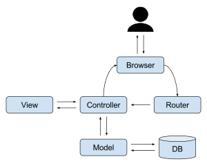

<h2>목차</h2>

- [Redux 등장 배경 및 사용이유](#redux-등장-배경-및-사용이유)
  - [MVC(Model-View-Controller) 패턴](#mvcmodel-view-controller-패턴)
  - [Flux 패턴](#flux-패턴)
  - [Redux](#redux)
  - [Flux와 Redux 차이?](#flux와-redux-차이)
  - [Reference](#reference)
- [Context API vs Redux](#context-api-vs-redux)
- [Redux 사용 방식](#redux-사용-방식)
  - [`store` 생성 및 `reducer` 함수 설정](#store-생성-및-reducer-함수-설정)
  - [`dispatch(action)` 함수로 상태 변경 요청](#dispatchaction-함수로-상태-변경-요청)
    - [`reducer`가 순수해야 하는 이유?](#reducer가-순수해야-하는-이유)
- [React-redux](#react-redux)
  - [리덕스 `store` 생성 및 제공](#리덕스-store-생성-및-제공)
  - [컴포넌트에서 `store` 데이터 사용하기](#컴포넌트에서-store-데이터-사용하기)
    - [`useSelector()` 훅](#useselector-훅)
- [Redux toolkit(RTK)](#redux-toolkitrtk)
- [Redux toolkit 시작하기](#redux-toolkit-시작하기)
  - [`createSlice`](#createslice)
  - [`configureStore`](#configurestore)
  - [store 생성하기](#store-생성하기)
  - [Reference](#reference-1)
- [Redux DevTools](#redux-devtools)

# Redux 등장 배경 및 사용이유

## MVC(Model-View-Controller) 패턴

MVC 패턴은 1970년대에 'Smalltalk-76'이라는 언어에 도입되어 지금까지 사용되는 소프트웨어 디자인 패턴 중 하나이다. 3가지 개념(Model, View, Controller)으로 애플리케이션을 구조화 하는데 Model에 데이터를 저장하고, Controller를 사용해 Model의 데이터를 관리하며 변경된 데이터를 View에 출력한다.

MVC는 애플리케이션을 간단한 형태로 구조화하여 이해하기 쉽게 만든다. 또 내부 로직과 데이터, UI를 분리하여 관리하기 쉽게 만든다는 장점이 있다.

<div style="text-align: center">
  
  <p style="color: gray">[위키피디아](https://ko.wikipedia.org/wiki/모델-뷰-컨트롤러)</p>
</div>

</br>
위 그림처럼 본질적인 MVC 패턴의 데이터 흐름은 단방향이다. 하지만 이는 엄격한 것이 아닌 하나의 추상적인 개념이므로 실제 웹 애플리케이션에선 아래와 같은 구조가 일반화되어 사용된다.
</br>


<div style="text-align: center">
  
  <p style="color: gray">[위키피디아](https://ko.wikipedia.org/wiki/모델-뷰-컨트롤러)</p>
</div>

</br>
<!-- 양방향 바인딩 깊은 이해 부족, 이미지 변경 고려-->
위와 같은 패턴의 특징은 양방향으로 데이터가 흐를 수 있다는 것이다. Model의 데이터가 변경되면 View도 변경되고, 또 View를 통해 데이터를 입력받아 직접 Model을 업데이트할 수도 있다. 규모가 커질수록 많은 Model과 View가 생성되게 되고 서로 의존도가 높아지게 된다면 데이터의 흐름이 복잡해지고 일부의 변경이 연쇄적인 변경을 일으켜 예측하기 어렵게 만들 수 있다.

이러한 문제로 애플리케이션을 확장하는데 한계가 있다고 판단한 Meta(전 Facebook)는 2014년 Flux라는 새로운 소프트웨어 아키텍처를 제안했고 이 패턴과 React를 통해 좀 더 예측하기 쉬운 형태로 코드를 구조화할 수 있을 것이라고 말한다.

## Flux 패턴 

Flux 패턴은 크게 4가지 개념(Store, Dispatcher, Action(Action 생성자), View)으로 구성되어 있다. 애플리케이션의 사용자 입력을 기반으로 Action을 생성하고, 이를 Dispatcher에 전달하여 Store의 데이터를 업데이트한 뒤 View에 반영하는 식의 단방향의 데이터 흐름을 가지는 소프트웨어 아키텍처이다.

</br>

<div style="text-align: center">
  
  <p style="color: gray">https://github.com/facebookarchive/flux</p>
</div>
</br>

<!-- **https://github.com/facebookarchive/flux 플럭스 깃헙 문서** -->

Flux 패턴은 데이터 흐름을 단방향으로 강제하기 때문에 흐름을 파악하기가 용이하고, 그 결과를 쉽게 예측할 수 있다는 장점이 있다.

하지만 일부에서는 Flux 패턴도 본질적으로 MVC와 크게 다를 바가 없으며 약간 개선된 형태에 새로운 이름을 붙인 것이라고 하기도 한다. 즉, Flux의 등장 배경은 페이스북 측에서 MVC를 잘못 사용한 것 때문이지, 순수 MVC의 한계 때문이 아니라는 것.

## Redux

Flux 패턴에 Dan Abramov이라는 개발자가 Reducer를 결합하여 좀 더 단순화하여 만든 라이브러리가 바로 `Redux`이다. `Redux`는 구체적인 부분에서 Flux와 약간 다르게 동작하는데 Dispatcher가 존재하지 않고 action을 Dispatch하면 `reducer`가 상태를 업데이트한다(상태는 store에 저장된다).  

`Redux`는 오픈 소스 자바스크립트 라이브러리이며 리액트 앱에서 가장 많이 사용하는 전역 상태 관리 라이브러리이다. `Redux`는 리액트에 종속된 라이브러리가 아니므로 순수 자바스크립트, 혹은 `Vue.js`나 `Angular.js`와 같은 뷰 프레임워크와도 사용할 수 있다.

`Redux`는 상태를 하나의 중앙 저장소(store)에 저장하여 관리하고 Flux와 마찬가지로 데이터 흐름이 단방향이기 때문에 이해하고 예측하기 쉬우며 디버깅도 용이하다.
</br>

<div style="text-align: center">
  
</div>
</br>

## Flux와 Redux 차이?

다음은 Flux와 `Redux`의 차이점이다. 

+ Flux는 아키텍처 패턴이고 `Redux`는 Flux 패턴의 구현이다.

+ `Redux`는 일반적으로 단일 저장소(store)를 사용하고 Flux 패턴은 여러 개의 저장소를 사용한다.
  + 여러 저장소마다 개별적인 처리 로직이 필요하기 때문에 내용 추적이 좀 더 까다로울 수 있다.
   
<!-- + 디스패치 프로세스? -->
+ Flux 패턴에는 싱글톤 객체인 단일 Dispather가 있으며 action을 전달하여 상태를 업데이트 한다. `Redux`에는 디스패처가 따로 없으며 `reducer`를 통해 상태 업데이트가 이루어진다(store 내부에 디스패치 프로세스가 내장 되어있다).

+ Flux 패턴에서 상태 업데이트 로직은 각각의 store에 저장되며 `Redux`에선 `reducer`에 저장된다(`reducer`없이 `store`을 정의할 수 없다).


## Reference

**[Flux Redux 차이]**

https://medium.com/edge-coders/the-difference-between-flux-and-redux-71d31b118c1

https://sunscrapers.com/blog/flux-and-redux-differences/

https://baeharam.netlify.app/posts/architecture/flux-redux (이미지 참고용)

**[Flux 패턴에 대하여]** 

http://fluxxor.com/what-is-flux.html

https://www.freecodecamp.org/news/an-introduction-to-the-flux-architectural-pattern-674ea74775c9/

**[페이스북의 결정: MVC는 확장에 용이하지 않다. 그렇다면 Flux다.]**

https://blog.coderifleman.com/2015/06/19/mvc-does-not-scale-use-flux-instead/

**[MVC vs. Flux ? Bidirectional vs. Unidirectional?]** 

https://stackoverflow.com/questions/33447710/mvc-vs-flux-bidirectional-vs-unidirectional

**[Redux 쓰는 이유?]** 

https://wooder2050.medium.com/%EB%A6%AC%EB%8D%95%EC%8A%A4-redux-%EB%8A%94-%EC%99%9C-%EC%93%B0%EB%8A%94-%EA%B1%B4%EB%8D%B0-2eaafce30f27

**[MERN을 통한 MVC 예시]** https://www.freecodecamp.org/news/mvc-architecture-what-is-a-model-view-controller-framework/

**[MVx 아키텍처]** https://www.clariontech.com/blog/evaluating-design-patterns-for-mobile-development

# Context API vs Redux 

리액트의 내장 기능인 `Context API`가 있는데도 `Redux`를 사용하는 이유는 `Context`의 단점 중 하나가 규모가 큰 애플리케이션에서 아래와 같이 매우 복잡해질 수 있다는 것이다.

```
return (
  <AuthContextProvider>
    <ThemeContextProvider>
      <UIINteractionContextProvider>
        <MultiStepFormContextProvider>
          <UserRegistration />
        </MultiStepFormContextProvider>
      </UIINteractionContextProvider>
    </ThemeContextProvider>
  </AuthContextProvider>
)
```

그렇다고 하나의 `Context`에 모든 상태를 담기엔 너무 복잡해지고 잦은 업데이트로 인해 불필요한 렌더링도 발생하게 된다. `Context`의 일부만 업데이트 해도 `Context`를 사용하는 모든 컴포넌트가 리렌더링되는 성질 때문(업데이트한 값을 사용하지 않더라도).

`React Redux`는 내부적으로 많은 성능 최적화를 구현하므로 컴포넌트가 사용하는 상태가 변경되었을 때만 다시 렌더링된다.

이러한 문제들의 대안으로 애플리케이션의 규모가 커지게 될수록 `Redux` 사용을 고려해볼 수 있다.

<!-- Context API 대신 Redux 사용 이유, 차이점 어렴풋이 이해하는 중. 내용 보완 필 -->
`Redux`는 상태를 하나의 중앙 저장소에 저장하여 관리하기 때문에 데이터 흐름을 이해하기 쉽고 디버깅도 용이하다. `Redux`는 MVC 패턴의 양방향 데이터 흐름으로 인한 복잡성을 해결하기 위해 만들어진 flux 패턴에 `reducer` 개념을 도입하여 만들어졌다(리액트 앱에서는 리액트에서 더 쉽게 `Redux`를 사용할 수 있게 해주는 `Redux-toolkit`이라는 라이브러리를 사용한다).

**결론적으로 `Redux`를 사용하는 이유는 전역 상태 값을 하나의 중앙 저장소에서 저장하여 관리하고 단방향 데이터 흐름을 통해 앱의 복잡도를 줄이고 예측하기 쉬운 코드를 작성하기 위한 것이다.**

먼저 `Redux`의 주요 개념과 순수 자바스크립트로 `Redux`를 사용해보고, 그 후 `react-redux`를 통해 리액트에 리덕스를 적용해볼 것이다.

**[Redux / Context API 장단점]**

https://likims.com/blog/context-vs-redux-pros-and-cons

# Redux 사용 방식

`Redux` 공식 문서에서는 `Redux`를 다음과 같이 설명하고있다.

```
Redux는 "액션"이라는 이벤트를 사용하여 애플리케이션 상태를 관리하고 업데이트하기 위한 패턴 및 라이브러리입니다.
상태가 예측 가능한 방식으로만 업데이트될 수 있도록 하는 규칙과 함께 전체 애플리케이션에서 사용해야 하는 상태에 대한 중앙 집중식 저장소 역할을 합니다.
```

위에서 말한 **중앙 저장소 역할**을 하는 `Redux`의 핵심 요소가 `store`이다. 

하나의 `store`에 전역 `state`가 저장되고, `dispatch`, `subscribe`, `getState`와 같은 메서드로 값을 간접적으로 업데이트하거나 조회한다(직접적으로 접근하는 것은 원본이 변경될 가능성이 있기 때문).

리액트가 아닌 순수 자바스크립트 코드를 통해 `Redux` 사용 예시를 살펴본다.

우선 npm에서 `redux`를 다운 받아준다.

```
npm install redux
```

## `store` 생성 및 `reducer` 함수 설정

우선 `store`를 생성하는데, 이때 상태 변경에 사용될 `reducer` 함수를 전달해준다.  
 
`reducer`는 `useReducer` 훅처럼 상태를 업데이트하는 역할을 한다. 상태 업데이트를 수행하는 `ruducer` 함수를 정의하고 `store`에 등록한다. 

```
import redux from 'redux';

// reducer 함수. 초기 값 설정 주의
const counterReducer = (state = { counter: 0 }, action) => {
  return {
    counter : state.counter + 1
  }
};

// reducer 전달하여 store 생성
const store = redux.createStore(counterReducer);

// 임시 컴포넌트
const counterSubscriber = () => {
  const latestsState = store.getState();
  return latestsState;
}

// store의 데이터를 사용 할 컴포넌트 subscribe
store.subscribe(counterSubscriber);
console.log(counterSubscriber());
```

`redux.createStore()`로 `store`을 초기화 해줄 때 `reducer`가 반환한 값이 곧 초기 값이 되는데(위에선 1) 이때 매개변수 초기 값을 설정하여 `undefined`를 참조하는 일이 없도록 해준다.

그 후 `store`의 상태를 사용할 컴포넌트들은(`store.getState()`로 상태를 사용하는 함수들) `store.subscribe(component)` 메서드를 사용하여 저장소를 `subscribe` 해줘야 한다.  

그러면 `redux`는 `store`의 데이터가 `dispatch`로 업데이트될 때마다 `subscribe`한 컴포넌트를 재호출한다. 여기서 알아야 할 것은 **데이터는 항상 단방향으로 `store` -> 컴포넌트로 흐른다는 것**. -> 이러한 방식으로 데이터 흐름을 단순화 한다.

## `dispatch(action)` 함수로 상태 변경 요청

`store.dispatch(action)` 메서드로 `reducer`를 호출하고 `action` 객체의 값에 따라 `reducer`에 작성된 로직을 실행한다. `reducer`가 반환한 값으로 `state`를 업데이트하고 `subscribe()` 중인 컴포넌트를 호출하여 새 값을 전달한다.

```
import redux from 'redux';

const counterReducer = (state = { counter: 0 }, action) => {

  switch (action.type) {
    case 'multiple':
      return {
        counter: state.counter * action.payload
      }
    default:
      return {
        counter : state.counter + 1
      }
  }
};

const store = redux.createStore(counterReducer);

const counterSubscriber = () => {
  const latestsState = store.getState();
  console.log(latestsState);
}

store.subscribe(counterSubscriber);
store.dispatch({ type: 'multiple', payload: 5 });
store.dispatch({ type: 'multiple', payload: 10 });

>> { counter: 5 }
   { counter: 50 }
```

위와 같은 매커니즘으로 공통적으로 사용되는 값을 하나의 `store`에서 관리해 로직을 간단하게 만들 수 있다.

### `reducer`가 순수해야 하는 이유?

여기까지는 다른 여타 상태 관리 라이브러리와 크게 다를 바가 없다.

`Redux`만의 강점이라고 할 수 있는 것은 브라우저의 `Redux DevTools` 확장 프로그램을 사용해 마치 버전 관리 시스템처럼 `store`에 저장된 `state`의 변경 히스토리를 확인하고, 또 원하는 지점으로 돌아갈 수 있다는 것!(공식 문서에서는 **'time-travel debugging'** 이라 표현한다).

여기서 **상태가 변경되는 것을 제대로 기록하기 위해서는 `reducer`는 순수 함수로 작성되어야 한다.** 또한 `Redux`와 `React-Redux`는 성능을 위해 모두 얕은 평등 검사(shallow equality checking)를 사용하기 때문에 새 값으로 교체하지 않게 되면 변경을 감지하지 못한다. 

```
성능이나 다른 이유 때문에 위해 순수하지 않은 리듀서를 작성하는 것도 기술적으로는 가능하지만, 이렇게 하지 않을 것을 권장합니다. 순수하지 않은 리듀서 구현은 시간 여행, 기록/재생, 핫 로딩과 같은 개발 지원 기능을 망가뜨립니다. 더욱이 불변성 때문에 대부분의 실제 애플리케이션에서 성능 문제가 있을 것 같아보이지만, Om이 증명했듯이 객체 할당에 있어서 성능에서 불리할 지라도 순수 함수를 통해 무엇이 바뀌었는지 정확히 판단할 수 있기 때문에 재렌더링이나 재계산 같은 값비싼 연산을 피한다는 점에서는 여전히 유리합니다.
```

**[Redux 홈 페이지]**

https://ko.redux.js.org/introduction/getting-started

# React-redux

`React-redux`는 `redux`의 공식 리액트 바인딩으로 리액트 컴포넌트에서 리덕스 `store` 데이터를 읽거나 `dispatch` 하는 등 `redux` 기능을 쉽게 사용할 수 있게 만들어주는 공식 도구이다(함수 컴포넌트를 예로 들면 `useSelector`, `useDispatch`와 같은 훅으로 `store`의 `state`를 더 리액트 친화적으로 사용할 수 있다).  

`React-redux`를 통해 리액트 앱에서 `redux`를 사용해본다.

`CRA`로 프로젝트를 생성하고 다음과 같이 `react-redux`를 다운로드 받아준다.

```
npm install react-redux
```

## 리덕스 `store` 생성 및 제공

`redux`의 `createStore` 메서드에 리듀서를 전달하여 `store`를 생성해준다. 그 다음 `react-redux`에서 제공하는 `<Provider />` 컴포넌트로 `store`를 제공할 수 있다.

`<Provider />` 컴포넌트의 사용 방식은 `Context API`와 비슷하다. 상태를 공유할 하위 컴포넌트들을 포함하는 부모 컴포넌트를 감싸주어 `store` `prop`으로 전달해주면 된다. 

아래의 예시는 최상위 컴포넌트인 `<App />`을 감싸주었기 떄문에 모든 컴포넌트들이 `store`를 사용할 수 있다.

```
// /src/store/index.js
// redux 로직 저장 파일
import { createStore } from 'redux';

const reducer = (state = { counter: 0, show: true }, action) => {
  switch (action.type) {
    case 'increase':
      return {
        counter: state.counter + action.payload,
        show: state.show
      };
    case 'decrease':
      return {
        counter: state.counter - action.payload,
        show: state.show
      };
    case 'toggle':
      return {
        counter: state.counter,
        show: !state.show
      };
    default:
      return {
        counter: state.counter,
        show: state.show
      };
  }
};

const store = redux.createStore(reducer);

export default store;
----------------------------------------------
// App.js
import React from 'react';
import ReactDOM from 'react-dom/client';
import { Provider } from 'react-redux';
import store from './store/index';

import './index.css';
import App from './App';

const root = ReactDOM.createRoot(document.getElementById('root'));
root.render(
  <Provider store={store}>
    <App />
  </Provider>
);
```

## 컴포넌트에서 `store` 데이터 사용하기

### `useSelector()` 훅

`useSelector()` 훅을 사용하여 리액트 컴포넌트 내부에서 `store`의 `state`를 사용할 수 있다(`useStore` 함수로도 `store` 데이터 사용. 클래스 컴포넌트에선 `connect API` 사용).

`useSelector()`를 사용하면 자동으로 `store`에 `subscribe` 되며 사용 중인 `state`가 변경될 때마다 컴포넌트가 렌더링된다. 또 컴포넌트가 언마운트 되면 자동으로 `subscribe`가 해제된다.

`useSelector()`의 인수로는 함수(선택기 함수라고 함)를 전달하는데, 이 함수는 컴포넌트가 렌더링될 때마다 인수로 `store`의 상태를 전달받아 호출되며 이 선택기 함수의 반환 값이 곧 `useSelector()`의 반환 값이 된다. 

`useSelector()`는 `action`이 `dispatch` 될 때마다 선택기 함수를 호출한다. 이때 선택기 함수의 이전 반환 값과 `dispatch` 후 새 반환 값을 비교하여(`===`사용) 값이 다른 경우 컴포넌트를 리렌더링 하고, 같을 경우 리렌더링 하지 않는다(따라서 상태가 객체인 경우에 다른 참조를 갖는 새 객체로 교체해줘야(불변성을 지켜야) 변경을 추적할 수 있다 -> `reducer`가 객체인 상태를 직접 변경하지 않는 순수함수이어야 하는 이유).

아래 코드는 `store`의 `state`를 가져오고, `dispatch`로 새 값을 전달받는 간단한 예제이다.

```
// counter.js
import { useDispatch, useSelector } from 'react-redux/es/exports';
import classes from './Counter.module.css';

const Counter = () => {
  // 선택기 함수 전달
  const counter = useSelector(state => state.counter);
  const dispatch = useDispatch();

  const increseHandler = () => {
    dispatch({ type: 'increase' });
  };

  const decreseHandler = () => {
    dispatch({ type: 'decrease' });
  };

  const toggleCounterHandler = () => { 
    dispatch({ type: 'toggle' });
  };

  return (
    <main className={ classes.counter }>
      <h1>Redux Counter</h1>
      <div className={ classes.value }>{ counter }</div>
      <div>
        <button onClick={increseHandler}>증가</button>
        <button onClick={decreseHandler}>감소</button>
      </div>
      <button onClick={ toggleCounterHandler }>Toggle Counter</button>
    </main>
  );
};

export default Counter;
```

**[react-redux `useSelector()`]**

https://react-redux.js.org/api/hooks#useselector

# Redux toolkit(RTK)

<!-- 내용보충 필 -->
앱의 규모가 커짐에 따라 생길 수 있는 redux의 문제점.

+ 기본 boilerplate를 위한 구성이 필요함(action 생성자, reducer, 필요에 따라 추가적인 미들웨어(redux-thunk 같은) 설치 등)
+ 상태 객체의 크기가 커질수록 불변성을 위해 복사 해야되는 양도 많아지고, `reducer`의 내용도 매우 길어짐.
+ 액션 type 명 충돌 가능성

이러한 일반적인 문제를 해결하기 위해 만들어 진 것이 `redux-toolkit` 이다.

`Redux Toolkit`은 `redux` 로직을 작성하는데 필요한 패키지와 기능이 포함되어 있는 리덕스 측에서 사용을 공식적으로 추천하는 도구이다(리액트 CRA와 같은 역할).

```
저희는 수동으로 작성하는 Redux 로직에서 "보일러 플레이트"를 제거하고, 흔한 실수를 방지하고, 기본적인 Redux 작업을 간단하게 만드는 API를 제공하기 위해 Redux Toolkit을 만들었습니다.
```

`Redux Toolkit` 패키지에서는 코어 `redux` 패키지에 추가로 필수적인 API 메서드와 모듈들을 포함하고 있으며 store 설정, 리듀서 생성 및 불변 수정 로직 작성, 상태 슬라이스 등과 같은 기능으로 `redux` 작업을 좀 더 단순화하고 실수를 방지하여 `redux` 코드 작성을 더 쉽게 만들어준다.

**[redux-toolkit 공식 사이트]**

https://redux-toolkit.js.org/introduction/getting-started

# Redux toolkit 시작하기

```
npm install @reduxjs/toolkit

// 리액트 환경이라면 +
npm install react-redux
```

`Redux Toolkit`에서 제공하는 `Redux` 앱에서 가장 일반적으로 하는 작업(`reducer` 정의, `store` 생성)을 간소화하는 두 가지 주요 API는 `createSlice`, `configureStore`이다.

## `createSlice`

`createSlice`는 Immer 라이브러리를 사용하는 불변 리듀서를 생성할 수 있게 해준다. 이를 통해 `state.value = 123`과 같은 "변형 (mutating)" JS 문법을 전개 연산자 없이도 불변성을 유지하며 업데이트할 수 있다. 또한, 각 리듀서에 대한 `action` 생성자 함수를 자동으로 생성하고, 리듀서 이름에 기반하여 내부적으로 액션 타입 문자열을 생성합니다. 마지막으로, TypeScript와 잘 호환됩니다.

## `configureStore`

`configureStore`는 한 번의 호출로 Redux 스토어를 설정하며, 리듀서를 결합하고 thunk 미들웨어를 추가하고, Redux DevTools 통합을 하는 등의 작업을 수행합니다. 또한, 이름이 있는 옵션 매개변수를 사용하기 때문에 createStore보다 구성이 쉽습니다.

## store 생성하기

```
// store.js
const counterSlice = createSlice({
  name: 'counterSlice',
  initilaState: {value: 0},
  reducers: {
    up: (state, action) => {
      state.value = state.value = action.payload;
    }
  }
});

const store = configureStore({
  reducer: {
    counter: counterSlice.reducer;
  }
});

export default store;
```


Redux Toolkit은 이 외에도, 다음과 같은 일반적인 Redux 작업을 수행할 수 있는 API를 제공합니다:

`createAsyncThunk`: "비동기 요청 전후에 액션을 디스패치"하는 표준 패턴을 추상화합니다

`createEntityAdapter`: 정규화된 상태에서 CRUD 작업을 수행하기 위한 미리 만들어진 리듀서와 셀렉터

`createSelector`: 메모이제이션된 셀렉터를 위한 표준 Reselect API 다시 내보내기(re-export)

`createListenerMiddleware`: 디스패치된 액션에 대한 응답으로 로직을 실행하기 위한 사이드 이펙트 미들웨어


## Reference

**[Redux Toolkit이 오늘날 Redux를 사용하는 방법인 이유]**

https://ko.redux.js.org/introduction/why-rtk-is-redux-today

# Redux DevTools

`Redux DevTools Extension`은 시간 경과에 따른 `Redux` `store`의 상태 변경 기록을 보여준다. 불변성(immutability)을 지키며 상태를 업데이트 하는 것으로 이전 상태로 돌아가기 같은 복잡한 기능을 쉽게 사용할 수 있다.
