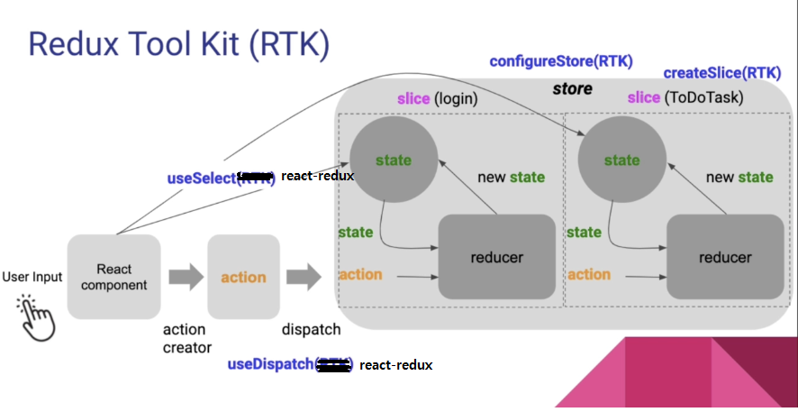

<h2>목차</h2>

- [Redux toolkit(RTK)이란?](#redux-toolkitrtk이란)
- [Redux toolkit 사용하기](#redux-toolkit-사용하기)
  - [`createSlice()`로 `slice` 생성하기](#createslice로-slice-생성하기)
  - [`configureStore()`로 `store` 생성하기](#configurestore로-store-생성하기)
  - [여러 개의 슬라이스 사용하기](#여러-개의-슬라이스-사용하기)
  - [`slice.actions`로 `action` 객체 생성하기](#sliceactions로-action-객체-생성하기)
  - [`action` `dispatch`하기](#action-dispatch하기)
  - [`action` `payload`에 여러 개의 인수를 전달하는 방법(`,`로 나열 된 여러 값)](#action-payload에-여러-개의-인수를-전달하는-방법로-나열-된-여러-값)
  - [Reference](#reference)
- [`Slice.caseReducers`로 리듀서 함수 호출하기](#slicecasereducers로-리듀서-함수-호출하기)
- [Redux Toolkit의 장점](#redux-toolkit의-장점)

# Redux toolkit(RTK)이란?

`Redux Toolkit(RTK)`은 `Redux`를 더 간단하고 실용적으로 만든 공식 툴셋으로 `Redux`의 핵심 철학(**단방향 데이터 흐름, 순수 함수 기반 상태 관리)은 그대로 유지하면서, 불필요한 보일러플레이트(반복 코드)를 대폭 줄이기 위해 만들어졌다.**

앱의 규모가 커짐에 따라 생길 수 있는 `redux`의 문제점은 다음과 같다.

- 기본 boilerplate를 위한 구성이 필요함(`action` 생성자, `action` 타입 상수 선언, `reducer` 결합, 필요에 따라 `redux-thunk` 같은 추가적인 미들웨어 설치 등)
- 상태 객체의 크기가 커질수록 불변성을 위해 복사해야 되는 양도 많아지고, 그에 따라 `reducer`의 내용도 매우 길어짐

이러한 일반적인 문제를 해결하기 위해 만들어 진 것이 `Redux Toolkit` 이다.

`Redux Toolkit` 패키지에서는 코어 `redux` 패키지에 추가로 필수적인 API 메서드와 모듈들을 포함하고 있으며(ex) `Redux Thunk` 및 `Reselect`) `store` 설정 편의성, 불변 리듀서 생성, `redux-thunk`, `Redux DevTools` 통합 같은 기능으로 `redux` 작업을 좀 더 단순화하고 실수를 방지하여 `redux` 코드 작성을 더 쉽게 만들어준다.

**<h2>Redux 데이터 흐름</h2>**

```
View → Dispatch(Action) → Reducer → Store → View
```

**[redux-toolkit 공식 사이트]**

https://redux-toolkit.js.org/introduction/getting-started

# Redux toolkit 사용하기

프로젝트에 `Redux Toolkit`과 `react-redux`를 추가해준다.

```
npm install @reduxjs/toolkit

// 리액트 환경이라면 +
npm install react-redux
```

`Redux Toolkit`에서 제공하는 주요 API는 다음과 같다.

| 기능                         | 설명                                             |
| ---------------------------- | ------------------------------------------------ |
| `configureStore()`           | 스토어 생성 (Redux DevTools, 미들웨어 자동 설정) |
| `createSlice()`              | Reducer + Action Creator 자동 생성               |
| `createAsyncThunk()`         | 비동기 로직 처리 (fetch, axios 등)               |
| `createEntityAdapter()`      | 리스트형 데이터(예: posts, todos) 관리 자동화    |
| `createListenerMiddleware()` | 특정 액션을 감지해 부가 작업 수행 가능           |

<!-- `createSelector`: 메모이제이션된 셀렉터를 위한 표준 Reselect API 다시 내보내기(re-export) -->

## `createSlice()`로 `slice` 생성하기

`createSlice`를 통해 `slice`를 생성할 수 있는데, **`slice`는 중앙 `store`를 이루는 조각이자 한 `state`를 담는 영역**이라 보면 된다.

</br>
<div style="text-align: center">
  
</div>
</br>

**`createSlice`로 슬라이스를 생성하면 `reducer`, `action type`, `action creator`가 자동으로 포함되어 생성된다.**

이때 `reducer` 같은 경우 내부적으로 `createReducer()`를 통해 생성되며, **생성된 리듀서 함수는 `Immer` 라이브러리를 사용하기 때문에 상태를 직접 변경하는 로직을 작성해도(ex)`state.value = 123`) 알아서 불변 값처럼 상태를 업데이트 한다.** 이로서 전개 연산자를 사용해 기존 값을 복사해줘야 했던 복잡한 로직을 간소화 한다.

또한, **각 슬라이스는 리듀서 함수의 동작을 식별하기 위한 `action` 객체의 생성자 함수를 자동으로 생성하고,**(이때 내부에서 `createAction()`를 사용한다) 이 **액션 생성자 함수는 리듀서 이름에 기반하여 내부적으로 고유의 액션 타입 문자열을 갖는 액션 객체를 생성한다**.

추가로, `createSlice()`는 TypeScript와도 호환된다.

`createSlice()`의 인수는 하나의 객체를 받는다. 객체에 포함되어야 하는 프로퍼티는 다음 3가지 이다.

- `name`- `slice`의 이름. 생성된 `action` `type`의 접두사로 사용된다
- `initialState` - 리듀서의 초기 상태
- `reducers` - 리듀서 함수 로직을 담은 객체

```
// store.js
import { createSlice } from '@reduxjs/toolkit';

const counterSlice = createSlice({
  name: 'counter',
  initialState: { value: 0 },
  reducers: {
    increment(state) {
      // Immer 라이브러리를 사용하므로 직접 state를 변경해도 불변성 자동 보장됨
      state.value += 1;
    },
    decrement(state) {
      state.value -= 1;
    },
    incrementByAmount(state, action) {
      state.value += action.payload;
    },
  },
});

export const { increment, decrement, incrementByAmount } = counterSlice.actions;
export default counterSlice.reducer;
```

슬라이스의 `reducers`에 전달한 리듀서 함수의 로직은 상태 객체를 직접 변경하는 것처럼 보이지만, 내부적으로 `Immer` 라이브러리를 사용하기 때문에 전개 연산자로 복사하여 새 객체를 전달하는 것과 같이 동작한다(따로 복사가 필요 없으므로 편리하다).

## `configureStore()`로 `store` 생성하기

**`configureStore`는 한 번의 호출로 `store`를 생성하며(`createStore`), 리듀서 조각을 결합하고(`combineReducers`) `thunk` 미들웨어를 추가하고, `Redux DevTools` 통합을 하는 등의 작업을 수행한다.**

다음은 `configureStore()` 함수의 인수로 하나의 객체를 전달하는 예시이다.

이 객체에는 `reducer`뿐 아니라 `middleware`, `devTools`, `duplicateMiddlewareCheck`, `preloadedState`, `enhancers` 같은 추가 옵션을 설정할 수 있다. 우선 기본으로 하나의 리듀서만 전달하여 `store`를 생성해본다.

```
// store.js
import { createSlice } from '@reduxjs/toolkit';

const counterSlice = createSlice({
  name: 'counter',
  initialState,
  reducers: {
    increment(state) {
      state.counter++;
    },
    decrement(state) {
      state.counter--;
    },
    incrementByAmount(state, action) {
      state.counter += action.payload;
    },
    toggle(state) {
      state.show = !state.show;
    },
  },
});

// 객체의 reducer 프로퍼티에 단일 리듀서 전달
const store = configureStore({
  reducer: counterSlice.reducer,
});

export default store;
```

## 여러 개의 슬라이스 사용하기

`configureStore()` 함수로 스토어를 생성할 때 기본적으로 단일 루트 리듀서를 인수로 전달 해야한다. **만약 `configureStore()`에 전달되는 객체의 `reducer` 프로퍼티에 여러 슬라이스 리듀서가 포함된 객체를 전달할 경우 자동으로 `redux` 코어의 `combineReducers()` 함수를 사용해 단일 루트 리듀서로 결합하여 전달된다**(`redux`만 사용했다면 따로 `combineReducers()`로 리듀서 결합 후 `createStore()`에 전달해줘야 했다).

`configureStore`로 스토어 생성 시 전달하는 객체의 `reducer` 프로퍼티에 각 리듀서의 이름과 그 값으로 생성한 슬라이스의 `reducer`를 전달해준다.

```
// store.js
import { configureStore } from '@reduxjs/toolkit';
import counterReducer from '../slices/counter';
import authReducer from '../slices/auth';

const store = configureStore({
  reducer: {
    counter: counterReducer,
    auth: authReducer,
  }
});

export default store;
```

위와 같은 경우 `counterReducer`와 `authReducer`가 하나의 리듀서로 결합되고, `store`의 상태는 `{ counter, auth }` 형태를 띄게 된다. 추가로 컴포넌트에서 `useSelector()`로 슬라이스의 상태를 사용할 때, 다음과 같이 각 슬라이스의 이름을 구체적으로 참조해줘야 하는 것 주의.

```
const isAuthenticated = useSelector(state => state.auth.isAuthenticated);
```

## `slice.actions`로 `action` 객체 생성하기

**`createSlice`로 리듀서 슬라이스를 생성하면 `Redux Toolkit`에 의해 자동적으로 액션 객체를 생성하는 액션 생성자 함수를 갖게 된다.**(내부적으로 `createAction` 사용) 이것으로 개발자는 액션 생성자 함수와 `dispatch`시 액션 타입 오타 같은 사소한 문제를 신경쓰지 않아도 된다는 장점이 있다.

`slice.actions` 프로퍼티를 통해 액션 생성자 함수가 담긴 객체를 참조할 수 있다.

```
console.log(counterSlice.actions);

>> {increment: ƒ, decrement: ƒ, incrementByAmount: ƒ, toggle: ƒ}
```

`counterSlice.actions` 객체에는 슬라이스에 정의한 리듀서 함수와 동일한 이름의 프로퍼티가 존재하며 각 프로퍼티에는 액션 생성자 함수가 바인딩 되어있다. 액션 생성자 함수를 호출하면 해당되는 리듀서 함수를 식별하기 위한 액션 객체를 반환한다.

```
counterSlice.actions.increment();

// increment()를 식별하기 위한 액션 객체
>> {type: 'counter/increment', payload: undefined}
```

액션 타입은 슬라이스 리듀서의 이름이 접두사로 붙고 `'/'`를 구분자로 리듀서 함수 이름이 그 뒤에 붙는다(`슬라이스/액션`).

```
counterSlice.actions.increment();
{type: "counter/increment"}

counterSlice.actions.decrement();
{type: "counter/decrement"}

counterSlice.actions.incrementByAmount();
{type: "counter/incrementByAmount"}

counterSlice.actions.toggle();
{type: "counter/toggle"}
```

## `action` `dispatch`하기

다음은 액션 생성자로 액션 객체를 생성하고, 필요시 `payload`를 전달하여 `state`를 업데이트하는 코드이다.

```
// slices/counter.js
import { createSlice } from "@reduxjs/toolkit";

const counterInitialState = { counter: 0, show: true };
const counterSlice = createSlice({
  name: 'counter',
  initialState: counterInitialState,
  reducers: {
    increment(state) {
      state.counter++;
      console.log(state.counter);
    },
    decrement(state) {
      state.counter--;
    },
    incrementByAmount(state, action) {
      state.counter += action.payload;
    },
    toggle(state) {
      state.show = !state.show;
    },
  },
});

export default counterSlice.reducer;
export const counterActions = counterSlice.actions;
----------------------------------------
import { useDispatch, useSelector } from 'react-redux/es/exports';
import { counterActions } from '../slices/counter';
import classes from './Counter.module.css';

const Counter = () => {
  const counter = useSelector(state => state.counter);
  const show = useSelector(state => state.show);
  const dispatch = useDispatch();

  const increaseHandler = () => {
    dispatch(counterActions.increment());
  };

  const increaseByAmountHandler = () => {
    dispatch(counterActions.incrementByAmount(5));
  };

  const decreaseHandler = () => {
    dispatch(counterActions.decrement());
  };

  const toggleCounterHandler = () => {
    dispatch(counterActions.toggle());
  };

  return (
    <main className={ classes.counter }>
      <h1>Redux Counter</h1>
      {show && <div className={ classes.value }>{ counter }</div>}
      <div>
        <button onClick={ increseHandler }>증가</button>
        <button onClick={ decreseHandler }>감소</button>
        <button onClick={ increseByAmountHandler }>+5 증가</button>
      </div>
      <button onClick={ toggleCounterHandler }>Toggle Counter</button>
    </main>
  );
};

export default Counter;
```

`action` 객체의 `payload`는 `increaseByAmountHandler` 함수 내부처럼 액션 생성자 함수의 인수를 통해 전달할 수 있다. **이때 하나의 인수만 전달할 수 있으며 여러 개인 경우 객체에 담아 전달하거나 다음과 같이 작성해줘야 한다.**

## `action` `payload`에 여러 개의 인수를 전달하는 방법(`,`로 나열 된 여러 값)

액션 객체의 `payload`에 여러 값을 다음과 같이 전달하는 방법도 있다. 아래의 `requestLoan` 프로퍼티처럼 **내부에 여러 개의 인수를 받는 `prepare` 메서드를 정의하고, 그 다음 `reducer` 메서드를 갖는 객체를 전달 해준다.**

`prepare` 메서드는 여러 인수를 받아 `action` 객체의 `payload` 프로퍼티 값이 될 새 객체를 반환해야 한다. 반환 된 객체는 함께 정의한 `reducer` 메서드의 인수(`action`)의 `payload`에 할당 된다.

```
const accountSlice = createSlice({
  name: "account",
  initialState,
  reducers: {
    deposit(state, action) {
      state.balance += action.payload;
      state.isLoading = false;
    },
    withdraw(state, action) {
      state.balance -= action.payload;
    },

    // { prepare, reducer } 할당
    requestLoan: {
      prepare(amount, purpose) {
        return {
          payload: { amount, purpose },
        };
      },
      reducer(state, action) {
        if (state.loan > 0) return;
        state.loan = action.payload.amount;
        state.loanPurpose = action.payload.purpose;
        state.balance = state.balance + action.payload.amount;
      },
    },

    payLoan(state) {
      state.balance -= state.loan;
      state.loan = 0;
      state.loanPurpose = "";
    },
    convertingCurrency(state) {
      state.isLoading = true;
    },
  },
});
-------------------------------------
function handleRequestLoan() {
  if (!loanAmount || !loanPurpose) return;
  dispatch(requestLoan(loanAmount, loanPurpose));
  setLoanAmount("");
  setLoanPurpose("");
}
```

## Reference

**[Redux Toolkit 앱 구조 - createSlice, configureStore 설명 등등]**

https://redux.js.org/tutorials/essentials/part-2-app-structure#creating-the-redux-store

**[Redux Toolkit이 오늘 날 Redux를 사용하는 방법인 이유 - Redux Toolkit Redux 코어 차이 등등]**

https://ko.redux.js.org/introduction/why-rtk-is-redux-today

**[store-setup-with-configurestore]**

https://redux.js.org/usage/migrating-to-modern-redux#store-setup-with-configurestore

# `Slice.caseReducers`로 리듀서 함수 호출하기

<!--  -->

`Slice.caseReducers`를 통해 특정 슬라이스의 리듀서 함수 내에서 다른 리듀서 함수를 호출할 수 있다.

```
const cartSlice = createSlice({
  name: 'cart',
  initialState,
  reducers: {
    addItem(state, action) {
      // payload = new pizza object
      const alreadyIn = state.cart.find(
        (pizza) => pizza.pizzaId === action.payload.pizzaId
      );
      if (alreadyIn) {
        alreadyIn.quantity += 1;
        alreadyIn.totalPrice = alreadyIn.quantity * alreadyIn.unitPrice;
      } else {
        state.cart.push(action.payload);
      }
    },
    deleteItem(state, action) {
      // payload = pizzaId
      state.cart = state.cart.filter(
        (pizza) => pizza.pizzaId !== action.payload
      );
    },
    clearCart(state) {
      state.cart = [];
    },
    increaseItem(state, action) {
      // payload = pizzaId
      const item = state.cart.find((pizza) => pizza.pizzaId === action.payload);
      item.quantity += 1;
      item.totalPrice = item.quantity * item.unitPrice;
    },
    decreaseItem(state, action) {
      // payload = pizzaId
      const item = state.cart.find((pizza) => pizza.pizzaId === action.payload);
      item.quantity -= 1;
      item.totalPrice = item.quantity * item.unitPrice;

      // cartSlice의 deleteItem 함수 호출
      if(item.quantity === 0) cartSlice.caseReducers.deleteItem(state, action)
    },
  },
});
```

# Redux Toolkit의 장점

| 항목                             | 설명                                                        |
| -------------------------------- | ----------------------------------------------------------- |
| ✅ 코드 간결                     | Action, Reducer, Type 정의를 한 곳에서 처리 (`createSlice`) |
| ✅ 불변성 자동 보장              | `Immer` 덕분에 `state.value++`처럼 써도 안전함              |
| ✅ 비동기 로직 간단화            | `createAsyncThunk`로 API 호출 관리                          |
| ✅ DevTools & 미들웨어 자동 설정 | `configureStore`로 설정 단순화                              |
| ✅ 타입스크립트 친화적           | 타입 추론이 잘 작동 (TS와 궁합 좋음)                        |

| 키워드    | 설명                                                  |
| --------- | ----------------------------------------------------- |
| 목적      | Redux를 더 쉽고 빠르게 사용하기 위해 만들어진 공식 툴 |
| 철학      | 단방향 데이터 흐름 유지 + 보일러플레이트 제거         |
| 주요 API  | `configureStore`, `createSlice`, `createAsyncThunk`   |
| 내부 기술 | Immer(불변성 자동), Redux Thunk, DevTools 연동        |
| 장점      | 간결한 코드, 유지보수 용이, 타입스크립트 친화적       |
