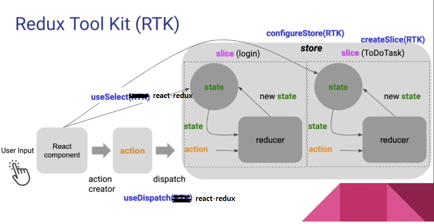

<h2>목차</h2>

- [Redux toolkit(RTK)](#redux-toolkitrtk)
- [Redux toolkit 사용하기](#redux-toolkit-사용하기)
  - [`createSlice()`로 `reducer` 생성](#createslice로-reducer-생성)
    - [slice란?](#slice란)
  - [`configureStore()`로 `store` 생성](#configurestore로-store-생성)
  - [여러 개의 슬라이스 사용하기](#여러-개의-슬라이스-사용하기)
  - [`reducer` 로직 식별을 위한 `action` 객체 생성하기](#reducer-로직-식별을-위한-action-객체-생성하기)
  - [`action` `dispatch`하기](#action-dispatch하기)
  - [`action` `payload`에 여러 값 전달하는 방법(객체 미사용)](#action-payload에-여러-값-전달하는-방법객체-미사용)
  - [Reference](#reference)
- [`Slice.caseReducers`로 리듀서 함수 호출하기](#slicecasereducers로-리듀서-함수-호출하기)

# Redux toolkit(RTK)

<!-- 내용보충 필 -->

앱의 규모가 커짐에 따라 생길 수 있는 `redux`의 문제점.

- 기본 boilerplate를 위한 구성이 필요함(`action` 생성자, `reducer`, 필요에 따라 `redux-thunk` 같은 추가적인 미들웨어 설치 등)
- 상태 객체의 크기가 커질수록 불변성을 위해 복사해야 되는 양도 많아지고, `reducer`의 내용도 매우 길어짐.
- 액션 type 명 오타 및 충돌 가능성

이러한 일반적인 문제를 해결하기 위해 만들어 진 것이 `redux-toolkit` 이다.

`Redux Toolkit`은 `redux` 로직을 작성하는데 필요한 패키지와 기능이 포함되어 있는 리덕스 측에서 사용을 공식적으로 추천하는 도구이다.

```
저희는 수동으로 작성하는 Redux 로직에서 "보일러 플레이트"를 제거하고, 흔한 실수를 방지하고, 기본적인 Redux 작업을 간단하게 만드는 API를 제공하기 위해 Redux Toolkit을 만들었습니다.
```

**`Redux Toolkit` 패키지에서는 코어 `redux` 패키지에 추가로 필수적인 API 메서드와 모듈들을 포함하고 있으며(ex) Redux Thunk 및 Reselect) `store` 설정 편의성, 불변 리듀서 생성, `redux-thunk`, `Redux DevTools` 통합 같은 기능으로 `redux` 작업을 좀 더 단순화하고 실수를 방지하여 `redux` 코드 작성을 더 쉽게 만들어준다.**

**[redux-toolkit 공식 사이트]**

https://redux-toolkit.js.org/introduction/getting-started

# Redux toolkit 사용하기

프로젝트에 `Redux Toolkit`과 `react-redux`를 추가해준다.

```
npm install @reduxjs/toolkit

// 리액트 환경이라면 +
npm install react-redux
```

`Redux Toolkit`에서 제공하는 `Redux` 앱에서 가장 일반적으로 하는 작업(`reducer` 정의, `store` 생성)을 간소화하는 두 가지 주요 API는 `createSlice`, `configureStore`이다.

## `createSlice()`로 `reducer` 생성

`createSlice`는 **내부적으로 `Immer` 라이브러리를 사용하는 불변 리듀서를 생성할 수 있게 해준다.** 이를 통해 `state.value = 123`과 같은 변형(mutating) JS 문법을 전개 연산자로 복사 없이도 불변성을 유지하며 업데이트할 수 있다(내부에서 `createReducer()`를 사용한다).

또한, **각 리듀서(슬라이스)에 대한 `action` 생성자 함수를 자동으로 생성하고, 이 액션 생성자 함수는 리듀서 이름에 기반하여 내부적으로 고유의 액션 타입 문자열을 갖는 액션 객체를 생성한다**(내부에서 `createAction()`를 사용한다).

추가로, `createSlice()`는 TypeScript와도 호환된다.

`createSlice()`의 인수는 하나의 객체를 받는다. 객체에 포함되어야 하는 프로퍼티는 다음 3가지 이다.

- `name`- `slice`의 이름. 생성된 `action` 유형의 접두사로 사용된다
- `initialState` - 리듀서의 초기 상태
- `reducers` - 리듀서 함수 로직을 담은 객체

```
// store.js
import { createSlice } from '@reduxjs/toolkit';

const counterSlice = createSlice({
  name: 'counter',
  initialState,
  reducers: {
    increment(state) {
      state.counter++;
    },
    decrement(state) {
      state.counter--;
    },
    incrementByAmount(state, action) {
      state.counter += action.payload;
    },
    toggle(state) {
      state.show = !state.show;
    },
  },
});
```

`createSlice()`로 생성된 객체는 다음과 같은 형태를 띈다.

```
{
    name : string,
    reducer : ReducerFunction,    // 리듀서 함수
    actions : Record<string, ActionCreator>, // 액션 객체 생성자 함수
    caseReducers: Record<string, CaseReducer>.
    getInitialState: () => State
}
```

슬라이스의 `reducers`에 전달한 슬라이스 리듀서 함수의 로직은 상태 객체를 직접 변경하는 것처럼 보이지만, 내부적으로 `Immer` 라이브러리를 사용하기 때문에 전개 연산자로 복사하여 새 객체를 생성하는 것과 같이 동작한다(따로 복사가 필요 없으므로 편리하다).

**[redux-toolkit createSlice]**

https://redux-toolkit.js.org/api/createSlice

### slice란?

<!-- 이해 좀더 필요 -->

슬라이스(slice)란 `reducer` 논리와 `action` 모음으로 단일 루트 리듀서를 이루는 조각 리듀서(전체 상태의 일부)라 생각하면 된다. 보통 하나의 파일에 정의되며 슬라이스란 이름은 하나의 루트 `Redux` 상태 객체를 여러 조각(slice)로 분할 한다는 의미에서 유래한다.

```
import { configureStore } from '@reduxjs/toolkit'
import usersReducer from '../features/users/usersSlice'
import postsReducer from '../features/posts/postsSlice'
import commentsReducer from '../features/comments/commentsSlice'

export default configureStore({
  reducer: {
    users: usersReducer,
    posts: postsReducer,
    comments: commentsReducer
  }
})
```

위 예시에서 `state.users`, `state.posts`, `state.comments`가 하나의 큰 상태의 조각(슬라이스)이 되고, `createSlice`로 생성한 각각의 슬라이스 리듀서에 전달되어 슬라이스의 리듀서 함수로 업데이트 된다.

결론적으로 슬라이스는 하나의 큰 상태의 일부를 사용하고 업데이트하는 서브 리듀서로 생각하면 될듯.

</br>

<div style="text-align: center">
  
</div>
</br>

## `configureStore()`로 `store` 생성

**`configureStore`는 한 번의 호출로 `Redux` 스토어를 설정하며, 리듀서 조각을 결합하고(`combineReducers()`) `thunk` 미들웨어를 추가하고, `Redux DevTools` 통합을 하는 등의 작업을 수행한다. 또한, 이름이 있는 옵션 매개변수를 사용하기 때문에 `createStore`보다 구성이 편리하다.**

다음은 `configureStore()` 함수의 인수로 하나의 객체를 전달한다. 이 객체에는 `reducer`뿐 아니라 `middleware`, `devTools`, `preloadedState`, `enhancers`과 같은 추가 옵션을 설정할 수 있다. 우선 기본으로 슬라이스 리듀서만 전달하여 `store`를 생성해본다.

```
// store.js
// 슬라이스 생성
import { createSlice } from '@reduxjs/toolkit';

const counterSlice = createSlice({
  name: 'counter',
  initialState,
  reducers: {
    increment(state) {
      state.counter++;
    },
    decrement(state) {
      state.counter--;
    },
    incrementByAmount(state, action) {
      state.counter += action.payload;
    },
    toggle(state) {
      state.show = !state.show;
    },
  },
});

// 객체의 reducer 프로퍼티에 슬라이스를 담은 객체를 전달(슬라이스가 하나이므로 객체에 담지 않고 직접 전달)
const store = configureStore({
  reducer: counterSlice.reducer
});

export default store;
```

## 여러 개의 슬라이스 사용하기

`configureStore()` 함수로 스토어를 생성할 때 기본적으로 단일 루트 리듀서를 인수로 전달 해야한다. **만약 `configureStore()`에 전달되는 객체의 `reducer` 프로퍼티에 여러 슬라이스 리듀서가 포함된 객체를 전달할 경우 자동으로 `redux` 코어의 `combineReducers()` 함수를 사용해 단일 루트 리듀서로 결합하여 전달된다**(`redux`만 사용했다면 따로 `combineReducers()`로 리듀서 결합 후 `createStore()`에 전달해줘야 했다).

여러 개의 슬라이스 리듀서를 사용할 때, `configureStore`로 스토어 생성 시 전달하는 객체의 `reducer` 프로퍼티에 각 리듀서의 이름과 그 값으로 생성한 슬라이스의 `reducer`를 전달해준다.

```
// store.js
import { configureStore } from '@reduxjs/toolkit';
import counterReducer from '../slices/counter';
import authReducer from '../slices/auth';

const store = configureStore({
  reducer: {
    counter: counterReducer,
    auth: authReducer,
  }
});

export default store;
```

위와 같은 경우 `counterReducer`와 `authReducer`가 루트 리듀서로 결합되고(`redux` 코어의 `combineReducers()`에 의해), `store`의 상태는 `{ counter, auth }` 형태를 띄게 된다. 추가로 컴포넌트에서 `useSelector()`로 슬라이스의 상태를 사용할 때, 각 슬라이스 리듀서의 이름을 참조해줘야 하는 것 주의.

```
const isAuthenticated = useSelector(state => state.auth.isAuthenticated);
```

## `reducer` 로직 식별을 위한 `action` 객체 생성하기

**`createSlice()`로 리듀서 슬라이스를 생성하면 `Redux Toolkit`에 의해 자동적으로 액션 객체를 생성하는 액션 생성자 함수를 갖게 된다.** 이것으로 개발자는 액션 생성자 함수와 `dispatch`시 액션 타입 오타 같은 사소한 문제를 신경쓰지 않아도 된다는 장점이 있다.

`counterSlice.actions` 프로퍼티를 통해 액션 생성자 함수가 담긴 객체를 참조할 수 있다.

```
console.log(counterSlice.actions);

>> {increment: ƒ, decrement: ƒ, incrementByAmount: ƒ, toggle: ƒ}
```

`counterSlice.actions` 객체에는 슬라이스 리듀서에 정의한 리듀서 함수와 동일한 이름의 프로퍼티가 존재하며 각 프로퍼티에는 액션 생성자 함수가 바인딩 되어있다. 액션 생성자 함수를 호출하면 해당되는 리듀서 함수를 식별하기 위한 액션 객체를 반환한다.

```
counterSlice.actions.increment();

// increment()를 식별하기 위한 액션 객체
>> {type: 'counter/increment', payload: undefined}
```

액션 타입은 슬라이스 리듀서의 이름이 접두사로 붙고 `'/'`를 구분자로 리듀서 함수 이름이 그 뒤에 붙는다(`슬라이스/액션`).

```
counterSlice.actions.increment();
{type: "counter/increment"}

counterSlice.actions.decrement();
{type: "counter/decrement"}

counterSlice.actions.incrementByAmount();
{type: "counter/incrementByAmount"}

counterSlice.actions.toggle();
{type: "counter/toggle"}
```

## `action` `dispatch`하기

다음은 액션 생성자로 액션 객체를 생성하고, 필요시 `payload`를 전달하여 `state`를 업데이트하는 코드이다.

```
// slices/counter.js
import { createSlice } from "@reduxjs/toolkit";

const counterInitialState = { counter: 0, show: true };
const counterSlice = createSlice({
  name: 'counter',
  initialState: counterInitialState,
  reducers: {
    increment(state) {
      state.counter++;
      console.log(state.counter);
    },
    decrement(state) {
      state.counter--;
    },
    incrementByAmount(state, action) {
      state.counter += action.payload;
    },
    toggle(state) {
      state.show = !state.show;
    },
  },
});

// configureStore()에 전달할 리듀서 export
export default counterSlice.reducer;

// 슬라이스 actions 객체 export
export const counterActions = counterSlice.actions;
----------------------------------------
import { useDispatch, useSelector } from 'react-redux/es/exports';
import classes from './Counter.module.css';
import { counterActions } from '../slices/counter'; // 슬라이스 actions 객체 import

const Counter = () => {
  const counter = useSelector(state => state.counter);
  const show = useSelector(state => state.show);
  const dispatch = useDispatch();

  const increseHandler = () => {
    dispatch(counterActions.increment());
  };

  const increseByAmountHandler = () => {
    dispatch(counterActions.incrementByAmount(5));
  };

  const decreseHandler = () => {
    dispatch(counterActions.decrement());
  };

  const toggleCounterHandler = () => {
    dispatch(counterActions.toggle());
  };

  return (
    <main className={ classes.counter }>
      <h1>Redux Counter</h1>
      {show && <div className={ classes.value }>{ counter }</div>}
      <div>
        <button onClick={ increseHandler }>증가</button>
        <button onClick={ decreseHandler }>감소</button>
        <button onClick={ increseByAmountHandler }>+5 증가</button>
      </div>
      <button onClick={ toggleCounterHandler }>Toggle Counter</button>
    </main>
  );
};

export default Counter;
```

`action`객체의 `payload`는 `increseByAmountHandler` 함수 내부처럼 액션 생성자 함수의 인수로 전달할 수 있다. **이때 하나의 인수만 전달할 수 있으며 여러 개인 경우 객체에 담아 전달하거나 다음과 같이 작성해줘야 한다.**

## `action` `payload`에 여러 값 전달하는 방법(객체 미사용)

액션 객체의 `payload`에 여러 값을 다음과 같이 전달하는 방법도 있다. 아래의 `requestLoan` 프로퍼티처럼 중첩 객체에 여러 인수를 받는 `prepare` 메서드를 정의하고, 그 다음 `reducer` 메서드를 정의 해준다.

`prepare` 메서드는 여러 인수를 받아 `payload`의 값이 될 새 객체를 반환해야 한다. 반환한 `payload` 객체는 바로 아래 정의한 `reducer` 메서드의 `action` 객체 `payload`가 된다.

```
const accountSlice = createSlice({
  name: "account",
  initialState,
  reducers: {
    deposit(state, action) {
      state.balance += action.payload;
      state.isLoading = false;
    },
    withdraw(state, action) {
      state.balance -= action.payload;
    },
    requestLoan: {
      prepare(amount, purpose) {
        return {
          payload: { amount, purpose },
        };
      },

      reducer(state, action) {
        if (state.loan > 0) return;
        console.log(action)
        state.loan = action.payload.amount;
        state.loanPurpose = action.payload.purpose;
        state.balance = state.balance + action.payload.amount;
      },
    },
    payLoan(state) {
      state.balance -= state.loan;
      state.loan = 0;
      state.loanPurpose = "";
    },
    convertingCurrency(state) {
      state.isLoading = true;
    },
  },
});
-------------------------------------
function handleRequestLoan() {
  if (!loanAmount || !loanPurpose) return;
  dispatch(requestLoan(loanAmount, loanPurpose));
  setLoanAmount("");
  setLoanPurpose("");
}
```

---

Redux Toolkit은 이 외에도, 다음과 같은 일반적인 Redux 작업을 수행할 수 있는 API를 제공합니다:

`createAsyncThunk`: "비동기 요청 전후에 액션을 디스패치"하는 표준 패턴을 추상화합니다 -> RTK에서 Thunk 사용하는 패턴

`createEntityAdapter`: 정규화된 상태에서 CRUD 작업을 수행하기 위한 미리 만들어진 리듀서와 셀렉터

`createSelector`: 메모이제이션된 셀렉터를 위한 표준 Reselect API 다시 내보내기(re-export)

`createListenerMiddleware`: 디스패치된 액션에 대한 응답으로 로직을 실행하기 위한 사이드 이펙트 미들웨어

## Reference

**[Redux Toolkit 앱 구조 - createSlice, configureStore 설명 등등]**

https://redux.js.org/tutorials/essentials/part-2-app-structure#creating-the-redux-store

**[Redux Toolkit이 오늘 날 Redux를 사용하는 방법인 이유 - Redux Toolkit Redux 코어 차이 등등]**

https://ko.redux.js.org/introduction/why-rtk-is-redux-today

**[store-setup-with-configurestore]**

https://redux.js.org/usage/migrating-to-modern-redux#store-setup-with-configurestore

# `Slice.caseReducers`로 리듀서 함수 호출하기

`Slice.caseReducers`를 통해 특정 슬라이스의 리듀서 함수내에서 다른 리듀서 함수를 호출할 수 있다.

```
const cartSlice = createSlice({
  name: 'cart',
  initialState,
  reducers: {
    addItem(state, action) {
      // payload = new pizza object
      const alreadyIn = state.cart.find(
        (pizza) => pizza.pizzaId === action.payload.pizzaId
      );
      if (alreadyIn) {
        alreadyIn.quantity += 1;
        alreadyIn.totalPrice = alreadyIn.quantity * alreadyIn.unitPrice;
      } else {
        state.cart.push(action.payload);
      }
    },
    deleteItem(state, action) {
      // payload = pizzaId
      state.cart = state.cart.filter(
        (pizza) => pizza.pizzaId !== action.payload
      );
    },
    clearCart(state) {
      state.cart = [];
    },
    increaseItem(state, action) {
      // payload = pizzaId
      const item = state.cart.find((pizza) => pizza.pizzaId === action.payload);
      item.quantity += 1;
      item.totalPrice = item.quantity * item.unitPrice;
    },
    decreaseItem(state, action) {
      // payload = pizzaId
      const item = state.cart.find((pizza) => pizza.pizzaId === action.payload);
      item.quantity -= 1;
      item.totalPrice = item.quantity * item.unitPrice;

      // cartSlice의 deleteItem 함수 호출
      if(item.quantity === 0) cartSlice.caseReducers.deleteItem(state, action)
    },
  },
});
```
