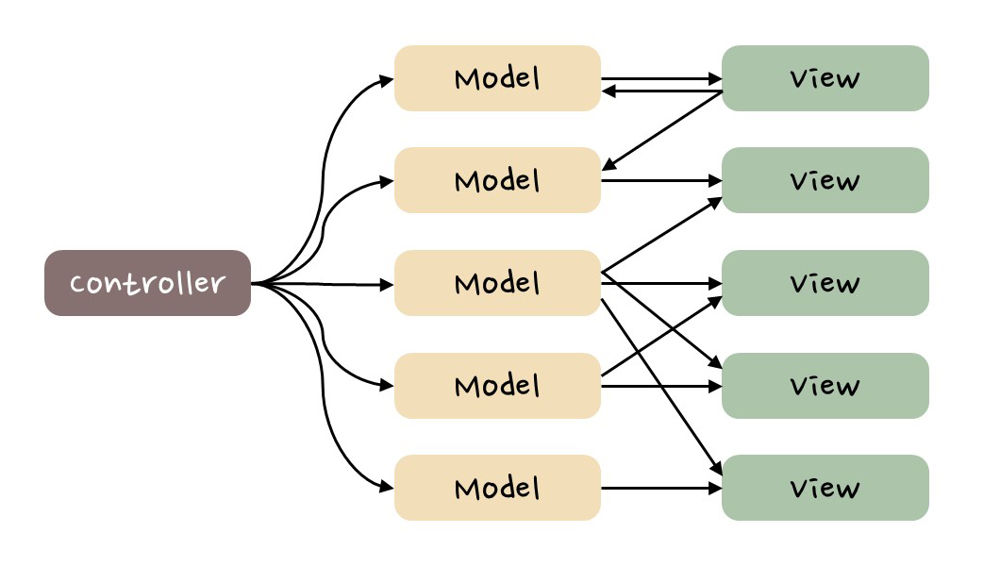

<h2>목차</h2>

- [Redux 등장 배경](#redux-등장-배경)
  - [MVC(Model-View-Controller) 패턴](#mvcmodel-view-controller-패턴)
  - [Flux 패턴이란?](#flux-패턴이란)
  - [Redux?](#redux)
    - [`reducer`란?](#reducer란)
  - [Flux와 Redux의 관계](#flux와-redux의-관계)
  - [Redux를 사용하는 이유](#redux를-사용하는-이유)
  - [Reference](#reference)

# Redux 등장 배경

## MVC(Model-View-Controller) 패턴

MVC 패턴은 1970년대에 'Smalltalk-76'이라는 언어에 도입되어 지금까지 사용되는 소프트웨어 디자인 패턴 중 하나로 3가지 개념(Model, View, Controller)으로 애플리케이션을 구조화 한다.

- `Model` : 데이터를 저장 및 관리 담당
- `View` : 화면에 출력 할 UI를 정의
- `Controller` : 모델과 뷰 사이에서 통신을 담당

<!-- Model에 데이터를 저장하고, 변경 시 뷰에게 알린다().
Controller를 사용해 Model의 데이터를 관리하며 변경된 데이터를 View에 출력한다. -->

MVC는 애플리케이션을 간단한 형태로 구조화하여 이해하기 쉽게 만든다. 또 내부 로직과 데이터, UI를 분리하여 관리하기 쉽게 만든다는 장점이 있다(소프트웨어의 비즈니스 로직과 화면을 구분하는데 중점을 두고 있다).

  
  
[위키피디아] https://ko.wikipedia.org/wiki/모델-뷰-컨트롤러

  

 
위 그림처럼 본질적인 MVC 패턴의 데이터 흐름은 단방향이다. 하지만 이는 엄격한 것이 아닌 하나의 추상적인 개념이므로 실제 웹 애플리케이션에선 아래와 같은 구조가 일반화되어 사용된다(데이터 흐름에 있어서는 일관되지 않고 구현에 따라 약간씩 달랐다).

 

  
  
[위키피디아] https://ko.wikipedia.org/wiki/모델-뷰-컨트롤러

  

 

MVC의 특징으로는 양방향으로 데이터가 흐를 수 있다는 것이다. Model의 데이터가 변경되면 View도 변경되고, 또 View를 통해 데이터를 입력받아 직접 Model을 업데이트할 수도 있다. 규모가 커질수록 많은 Model과 View가 생성되게 되고 다대다로 의존하게 된다면 데이터의 흐름이 복잡해지고 일부의 변경이 연쇄적인 변경을 일으켜 예측하기 어렵게 만들 수 있다.

 

  
  
[TCP school] https://tcpschool.com/react/react_redux_intro

  

 

이러한 문제로 애플리케이션을 확장하는데 한계가 있다고 판단한 Meta(전 Facebook)는 2014년 Flux라는 새로운 소프트웨어 아키텍처를 제안했고 이 패턴과 React를 통해 좀 더 예측하기 쉬운 형태로 코드를 구조화할 수 있을 것이라고 말한다.

## Flux 패턴이란?

Flux 패턴은 크게 4가지 구성 요소로(Store, Dispatcher, Action(Action 생성자), View)으로 이루어져 있다.

| 구성 요소                  | 역할                                                                                                                                |
| -------------------------- | ----------------------------------------------------------------------------------------------------------------------------------- |
| **Action**                 | “무슨 일이 일어났는가?”를 설명하는 객체. ex) `{ type: 'ADD_TODO', payload: '공부하기' }`                                            |
| **Dispatcher**             | 모든 Action을 중앙에서 받아 Store로 전달하는 중계자. (Store로 가는 단 하나의 통로로 여기서 “어떤 Store가 Action을 받을지”를 결정함) |
| **Store**                  | 실제 상태(state)와 비즈니스 로직이 존재하는 곳. Dispatcher로부터 Action을 받고 상태를 변경함.                                       |
| **View (React Component)** | Store의 상태를 구독하고, 상태가 바뀌면 다시 렌더링 되며 유저 인터랙션이 일어나면 Action을 발생시킴.                                 |

애플리케이션의 사용자 상호작용을 기반으로 Action이 생성되고, Dispatcher를 통해 store로 전달 된다. 이후 store에서 상태를 업데이트한 뒤 View에 반영하는 식의 **단방향의 데이터 흐름을 가지는 소프트웨어 아키텍처**이다.

 

  
  
https://github.com/facebookarchive/flux

 

<!-- **https://github.com/facebookarchive/flux 플럭스 깃헙 문서** -->

Flux 패턴은 데이터 흐름을 단방향으로 강제하기 때문에 흐름을 파악하기가 용이하고, 그 결과를 쉽게 예측할 수 있다는 장점이 있다.

하지만 일부에서는 Flux 패턴도 본질적으로 MVC와 크게 다를 바가 없으며 약간 개선된 형태에 새로운 이름을 붙인 것이라고 하기도 한다. 즉, Flux의 등장 배경은 페이스북 측에서 MVC를 잘못 사용한 것 때문이지, 순수 MVC의 한계 때문이 아니라는 것.

**[Flux]**

https://haruair.github.io/flux/docs/overview.html

## Redux?

Dan Abramov이라는 개발자가 Flux 패턴에 `reducer`를 결합하여 좀 더 단순화하여 만든 전역 상태 관리 라이브러리가 바로 `Redux`이다. `Redux`는 구체적인 부분에서 Flux와 약간 다르게 동작하는데 `Dispatcher`가 존재하지 않고 `action`을 `Dispatch`하면 `reducer`가 상태를 업데이트한다(상태는 단일 `store`에 저장된다).

`Redux`는 오픈 소스 자바스크립트 라이브러리이며 리액트 앱에서 가장 많이 사용하는 전역 상태 관리 라이브러리이다. `Redux`는 리액트에 종속된 라이브러리가 아니므로 순수 자바스크립트, 혹은 `Vue.js`나 `Angular.js`와 같은 뷰 프레임워크와도 사용할 수 있다.

`Redux`는 상태를 하나의 중앙 저장소(`store`)에 저장하여 관리하고 Flux와 마찬가지로 데이터 흐름이 단방향이기 때문에 이해하고 예측하기 쉬우며 디버깅도 용이하다.

 

  

 

### `reducer`란?

리듀서(감속기, 감속기 함수)란 함수형 프로그래밍에서 사용되는 일반적인 개념으로 누적 값과 새 값을 받아 새로운 누적 값을 반환하는 함수를 말한다. 여러 값을 하나의 값으로 줄이는데 사용된다(자바스크립트 배열 내장 메서드(`Array.prototype.reduce()`)에서도 볼 수 있다).

**리듀서는 동기적으로 동작하며 부수 효과(side effect)가 없는 순수 함수 여야 한다.**

`Redux`에서 누적된 값은 이전 상태(state) 객체이고, 새 값은 `action`이다. 리듀서는 이전 상태와 `action`을 통해 새 누적 상태를 계산해 반환한다. 이때 `reducer` 함수는 순수 해야 한다!

**[Redux.js - reducer란]** https://redux.js.org/understanding/thinking-in-redux/glossary#reducer

**[부수효과와 순수함수]** https://maxkim-j.github.io/posts/js-pure-function/

## Flux와 Redux의 관계

다음은 Flux와 `Redux`의 차이점이다.

<!--  -->

- Flux는 아키텍처 패턴이고 `Redux`는 Flux 패턴의 구현이다.

- `Redux`는 일반적으로 단일 저장소(store)를 사용하고 Flux 패턴은 여러 개의 저장소를 사용한다.

  - 여러 저장소마다 개별적인 처리 로직이 필요하기 때문에 내용 추적이 좀 더 까다로울 수 있다.

- Flux 패턴에는 싱글톤 객체인 단일 Dispather가 있으며 action을 전달하여 상태를 업데이트 한다. `Redux`에는 디스패처가 따로 없으며 `reducer`를 통해 상태 업데이트가 이루어진다(store 내부에 디스패치 프로세스가 내장 되어있다).

- Flux 패턴에서 상태 업데이트 로직은 각각의 store에 저장되며 `Redux`에선 `reducer`에 저장된다(`reducer`없이 `store`을 정의할 수 없다).

<!-- + Flux 불변성 x redux 불변성 o -->

다음은 Redux와 Flux 패턴과 주요 차이점을 정리한 표이다.

| 비교 항목     | Flux                                      | Redux                                  |
| ------------- | ----------------------------------------- | -------------------------------------- |
| Dispatcher    | 있음 (중앙 허브 역할)                     | 없음 (dispatch 함수가 그 역할을 대체)  |
| Store         | 여러 개 가능                              | 단 하나만 존재                         |
| State 변경    | Store 내부에서 직접 수행                  | Reducer를 통해 순수 함수로 변경        |
| 구조적 복잡도 | 비교적 복잡                               | 훨씬 단순화됨                          |
| 데이터 흐름   | View → Action → Dispatcher → Store → View | View → Action → Reducer → Store → View |

## Redux를 사용하는 이유

다음은 Redux와 같은 전역 상태 관리 라이브러리를 사용하는 이유를 정리한 표다.

| 핵심 포인트    | 설명                                                   |
| -------------- | ------------------------------------------------------ |
| 목적           | 복잡한 상태 관리의 예측 가능성과 추적성을 높이기 위함  |
| 데이터 흐름    | 단방향 (View → Action → Dispatcher → Store → View)     |
| 이점           | 상태 변경 추적이 용이, 디버깅 쉬움, 데이터 일관성 유지 |
| 단점           | 구조가 다소 복잡함 (Dispatcher, Store 관리 필요)       |
| Redux와의 관계 | Flux의 철학을 단순화하여 구현한 라이브러리             |

## Reference

**[Flux Redux 차이]**

https://medium.com/edge-coders/the-difference-between-flux-and-redux-71d31b118c1

https://sunscrapers.com/blog/flux-and-redux-differences/

https://baeharam.netlify.app/posts/architecture/flux-redux (이미지 참고용)

**[Flux 패턴에 대하여]**

http://fluxxor.com/what-is-flux.html

https://www.freecodecamp.org/news/an-introduction-to-the-flux-architectural-pattern-674ea74775c9/

**[페이스북의 결정: MVC는 확장에 용이하지 않다. 그렇다면 Flux다.]**

https://blog.coderifleman.com/2015/06/19/mvc-does-not-scale-use-flux-instead/

**[MVC vs. Flux ? Bidirectional vs. Unidirectional?]**

https://stackoverflow.com/questions/33447710/mvc-vs-flux-bidirectional-vs-unidirectional

**[Redux 쓰는 이유?]**

https://wooder2050.medium.com/%EB%A6%AC%EB%8D%95%EC%8A%A4-redux-%EB%8A%94-%EC%99%9C-%EC%93%B0%EB%8A%94-%EA%B1%B4%EB%8D%B0-2eaafce30f27

**[MERN을 통한 MVC 예시]** https://www.freecodecamp.org/news/mvc-architecture-what-is-a-model-view-controller-framework/

**[MVx 아키텍처]** https://www.clariontech.com/blog/evaluating-design-patterns-for-mobile-development

**[프론트엔드 아키텍처의 가장 최근 트렌드는?]**

https://yozm.wishket.com/magazine/detail/1663/
